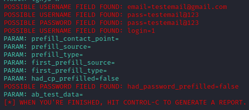

# cybersecurity-desafio-phishing

### phishing para captura de senhas do Facebook
Usaremos o site do ``` Facebook ``` como exemplo

### Ferramentas utilizadas:
- Kali Linux (https://www.kali.org/)
- setoolkit (ferramenta pré-instalada no Kali Linux)

### Resumo passo-a-passo (Configuração da ferramenta setoolkit para a construção do phishing):
1 - Acesso root:  ``` sudo su  ``` <br>
2 - iniciando o setoolkit:  ``` setoolkit  ``` <br>
3 - Tipos de ataque: ``` Social-Engineering Attacks ```<br>
4 - Vetor de ataque: ``` Web Site Attack Vectors ``` <br>
5 - Método de ataque: ```Credential Harvester Attack Method ``` <br>
6 - Método de ataque: ``` Site Cloner ``` <br>
7 - Obtendo o endereço da máquina: ``` ifconfig ``` <br>
8 - URL para clone: http://www.facebook.com <br>

### Resultados


